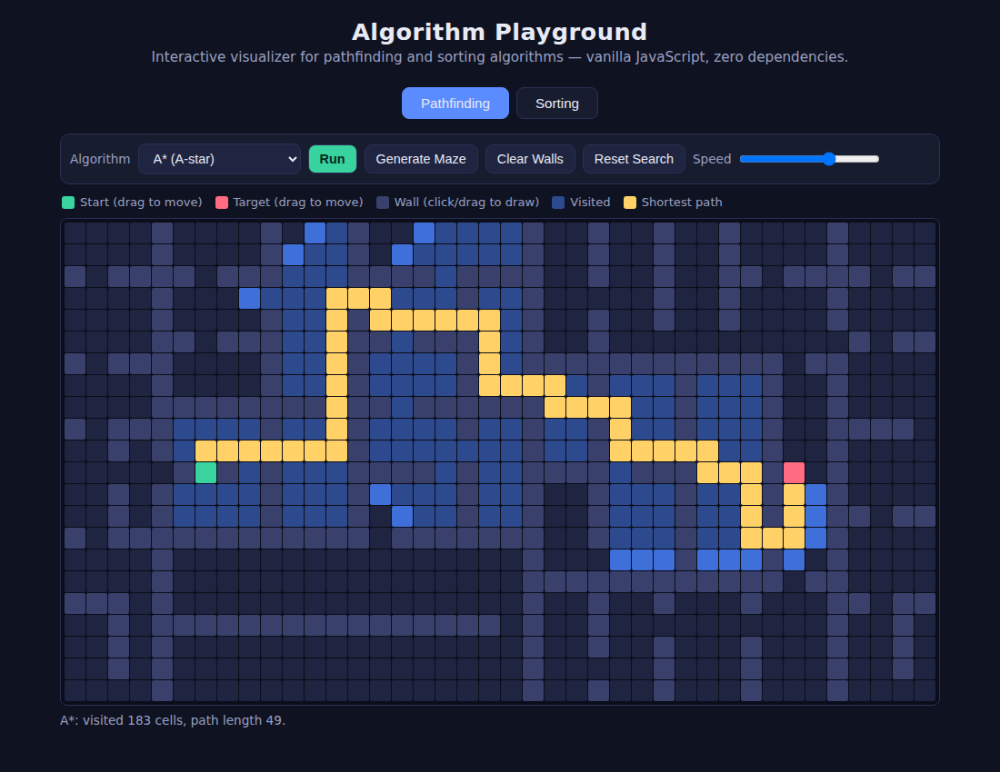
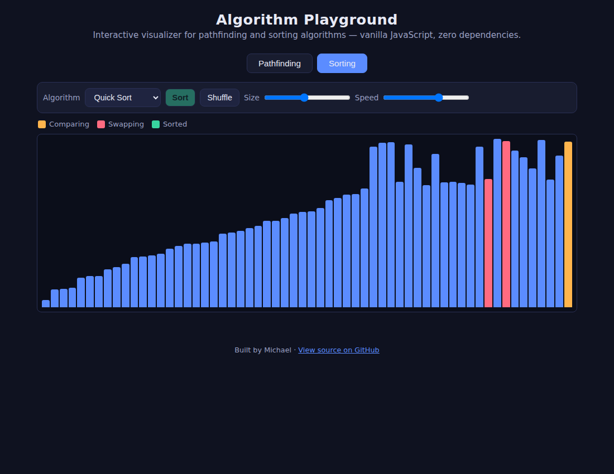

# Algorithm Playground

An interactive visualizer for classic pathfinding and sorting algorithms, written in **plain HTML, CSS, and JavaScript** — no frameworks, no build step, no dependencies. Open `index.html` in any browser and it just works.

**[▶ Live demo](https://kolouring.github.io/algorithm-playground/)** *(update this link after enabling GitHub Pages — see below)*

## Pathfinding



Draw walls with your mouse, drag the start and target points anywhere, generate a random maze, and watch the algorithm explore the grid in real time. When it reaches the target, it traces the path back in yellow.

Implemented algorithms:

| Algorithm | How it picks the next cell | Guarantees shortest path? |
|---|---|---|
| **A\*** | lowest *(cost so far + estimated cost left)* | Yes — and usually fastest |
| **Dijkstra** | lowest cost so far | Yes |
| **Breadth-First Search** | first-in, first-out queue | Yes (on unweighted grids) |
| **Depth-First Search** | last-in, first-out stack | No — dives deep instead |

All four share the same skeleton (a frontier of cells to explore plus "came from" pointers to rebuild the path); the only difference is how the next cell is chosen. That's the core insight this project is built around, and the code is structured to make it visible.

The maze generator uses **recursive division**: split the grid with a wall that has one gap in it, then recursively split each half.

## Sorting



Bars represent array values. Orange bars are being compared, red bars are being swapped, and green means done. A counter reports total comparisons and writes when the sort finishes, so you can directly compare, say, bubble sort's ~1,800 comparisons against merge sort's ~300 on the same 60 elements.

Implemented: **bubble sort, insertion sort, selection sort, merge sort, quick sort** — with adjustable array size (10–120) and animation speed.

## Running it locally

No install needed:

```
git clone https://github.com/kolouring/algorithm-playground.git
cd algorithm-playground
open index.html        # macOS — or just double-click the file
```

## Hosting the live demo (GitHub Pages)

1. Push this repo to GitHub.
2. In the repo, go to **Settings → Pages**.
3. Under "Build and deployment", set Source to **Deploy from a branch**, pick `main` and `/ (root)`, and save.
4. After a minute your demo is live at `https://YOUR-USERNAME.github.io/algorithm-playground/` — update the link at the top of this README.

## How the code is organized

Everything lives in `index.html`, split into three commented sections:

1. **Shared helpers** — the `sleep()` function that drives the animations via `async/await`, and tab switching.
2. **Pathfinding** — grid construction, mouse/touch input, the unified search loop, path reconstruction, and the maze generator.
3. **Sorting** — the bar renderer plus the five sorting algorithms, each instrumented to count comparisons and writes.

## Ideas I'd like to add

- Weighted terrain (mud/water cells that cost more to cross) to show where Dijkstra and BFS diverge
- Greedy best-first search, to show what happens when A* ignores the "cost so far" term
- Heap sort and a proper priority queue for the pathfinding frontier
- Step-by-step mode with an explanation of each decision

## License

[MIT](LICENSE) — free to use, learn from, and remix.
